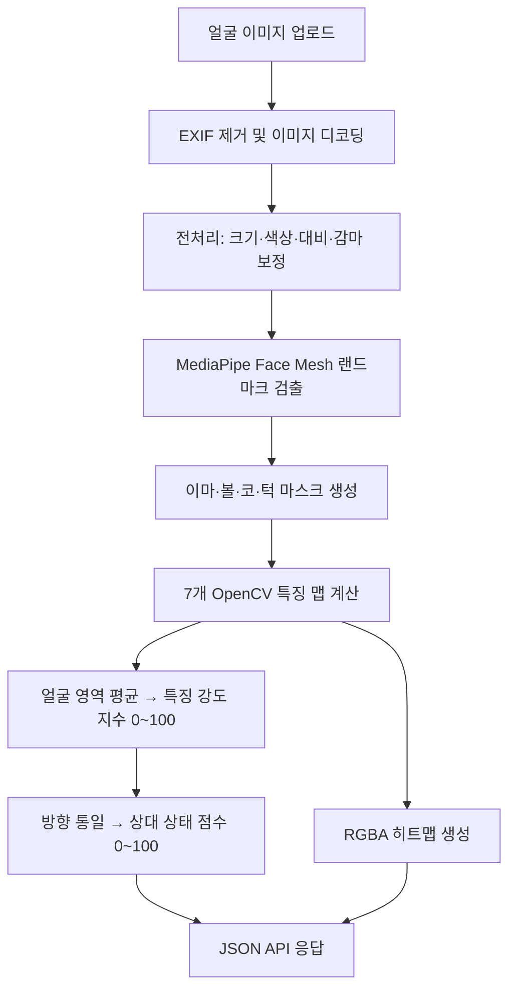

# Runcovery Skin Analysis API

얼굴 사진에서 얼굴 영역을 찾고, OpenCV 기반 영상처리로 피부의 시각적 특징을 분석하는 FastAPI 서비스입니다.

분석 항목은 붉음, 유분, 피부결, 모공, 잡티, 수분감, 색소침착의 7가지입니다. 결과는 특징이 얼마나 강하게 검출됐는지 나타내는 `indices`, 모든 항목을 높을수록 양호한 방향으로 맞춘 `condition_scores`, 그리고 위치를 확인할 수 있는 히트맵으로 반환됩니다.

> 이 프로젝트는 피부 질환을 진단하는 의료기기가 아닙니다. 일반 카메라 영상에서 보이는 특징을 규칙 기반으로 추정하는 교육·연구용 프로토타입입니다.

## 핵심 요약

| 구분 | 내용 |
|---|---|
| 입력 | 정면에 가까운 얼굴 이미지 1장 |
| 얼굴 검출 | MediaPipe Face Mesh |
| 피부 분석 | OpenCV, NumPy, scikit-image 기반 규칙 알고리즘 |
| 분석 결과 | 7개 특징 강도 지수, 상대 상태 점수, 히트맵 |
| 서버 | FastAPI |
| 외부 분석 API | 사용하지 않음 |
| 피부 학습 데이터 | 별도로 사용하지 않음 |
| 의료 진단 | 지원하지 않음 |

## 왜 학습형 AI 대신 OpenCV를 사용했는가?

현재 목표는 의료 진단 모델을 만드는 것이 아니라, 제한된 데이터와 개발 기간 안에서 **설명 가능하고 재현 가능한 피부 영상 분석 기준을 구현하는 것**입니다.

### 1. 검증된 학습 데이터가 없는 AI는 신뢰하기 어렵습니다

피부 분석용 딥러닝 모델에는 피부톤, 연령, 성별, 촬영기기, 조명이 다양하게 포함된 대규모 라벨 데이터가 필요합니다. 데이터가 부족하거나 편향되면 특정 피부톤이나 촬영환경에서만 성능이 높고 다른 사용자에게는 잘못된 결과를 낼 수 있습니다.

현재 프로젝트에는 전문가가 라벨링한 피부 데이터가 없으므로 근거가 부족한 AI 분류기를 학습시키는 대신, 색공간·밝기·질감·경계·블롭처럼 관찰 가능한 영상 특징을 명시적인 규칙으로 계산합니다.

### 2. 결과의 산정 근거를 설명할 수 있습니다

- 붉음: LAB 색공간의 a\* 채널
- 유분: 밝고 채도가 낮은 반사광 후보
- 피부결: Laplacian 지역 분산과 Local Binary Pattern
- 모공: 고역 통과 필터로 찾은 작은 어두운 블롭
- 잡티: 붉음, 국소 어두움, 밝기 변화, 블롭의 조합
- 수분감: 거칠기, 밝기 불균일, 경계 강도로 만든 건조도 proxy의 반전
- 색소침착: 얼굴 평균보다 어두운 영역과 LAB의 황색·적색 성분

규칙과 가중치가 코드에 드러나므로 심사, 디버깅, 임계값 조정에서 결과가 나온 이유를 추적할 수 있습니다.

### 3. 로컬에서 빠르고 저렴하게 실행됩니다

외부 AI API나 GPU 서버가 필요하지 않습니다. 이미지가 외부 분석 서비스로 전송되지 않으며 일반 CPU 환경에서 실행할 수 있어 비용과 네트워크 의존성이 낮습니다.

### 4. 향후 AI와 비교할 baseline이 됩니다

현재 알고리즘은 데이터가 확보됐을 때 AI 모델과 성능을 비교할 수 있는 설명 가능한 baseline입니다. 전문가 라벨이나 피부 측정기 데이터가 확보되면 규칙의 임계값을 보정하거나 일부 항목만 학습형 모델로 교체할 수 있습니다.

### MediaPipe도 AI 아닌가?

MediaPipe Face Mesh 내부에는 사전학습된 머신러닝 모델이 사용됩니다. 따라서 이 프로젝트가 AI를 전혀 사용하지 않는다고 표현하는 것은 정확하지 않습니다.

다만 MediaPipe는 피부 상태를 판정하거나 점수를 생성하지 않습니다. 얼굴 랜드마크를 찾아 이마, 볼, 코, 턱의 분석 영역을 정하는 용도로만 사용합니다. 실제 7개 피부 특징의 산정은 별도의 학습형 피부 모델이 아니라 OpenCV 기반 규칙 알고리즘이 담당합니다.

```text
MediaPipe: 어디가 얼굴 피부 영역인지 결정
OpenCV: 그 영역에서 어떤 시각적 특징이 얼마나 나타나는지 계산
```

## 피부톤이 다른 사람에게 같은 기준을 적용해도 구별되는가?

결론부터 말하면, **개인의 얼굴 내부에서 상대적인 차이를 찾는 데는 어느 정도 대응하지만 모든 피부톤에서 동일한 정확도를 보장하지는 않습니다.**

### 현재 적용한 피부톤 영향 완화 방법

#### 1. Gray-world 색상 보정

입력 이미지의 RGB 채널 평균을 맞춰 조명 색조와 화이트밸런스 차이를 일부 줄입니다.

#### 2. 얼굴 내부 상대 정규화

붉음과 색소 등의 항목은 고정 RGB 값만 비교하지 않고, 검출된 사용자 얼굴의 평균·표준편차·최솟값·최댓값 또는 백분위를 사용합니다.

예를 들어 붉음은 밝은 피부와 어두운 피부를 동일한 절대값으로 단순 비교하기보다, **한 사람의 얼굴 안에서 주변 피부보다 상대적으로 붉은 영역**을 찾습니다.

#### 3. 구조적 특징의 병행 사용

피부결, 모공, 수분감은 색상만 보지 않고 밝기 변화, 질감, 경계, 국소 패턴을 함께 사용합니다. 이는 피부톤 자체의 영향을 일부 줄이는 데 도움이 됩니다.

### 아직 남아 있는 한계

현재 보정만으로 피부톤 공정성이 검증됐다고 말할 수는 없습니다.

- 유분 검출의 `V > 200`, `S < 80`은 절대 임계값이므로 어두운 피부나 어두운 조명에서 반사광을 놓칠 수 있습니다.
- 색소 알고리즘의 LAB a\*/b\* 성분은 기본 피부톤의 영향을 받을 수 있습니다.
- 카메라 자동 보정, HDR, 뷰티 필터, 메이크업, 그림자가 결과에 영향을 줍니다.
- 현재 점수는 기준 인구집단이나 피부 전문가 라벨로 보정되지 않았습니다.
- 같은 사람을 다른 환경에서 촬영한 값과 서로 다른 사람의 값을 직접 비교하기 어렵습니다.

따라서 현재 결과는 **개인 사진 내부의 상대 특징 지수**로 해석해야 하며, 피부톤 간 우열이나 임상적 정상·비정상을 판정하는 용도로 사용하면 안 됩니다.

### 향후 검증 및 개선 계획

1. 다양한 피부톤의 테스트셋을 Fitzpatrick 또는 Monk Skin Tone 기준으로 구간화합니다.
2. 동일 인물을 조명, 카메라, 거리만 바꿔 반복 촬영하여 점수 변동을 측정합니다.
3. 피부톤 그룹별 오차, 검출률, 재현성을 별도로 비교합니다.
4. 피부 전문가 평가 또는 측정기 결과와 API 결과의 상관관계를 확인합니다.
5. 절대 임계값을 얼굴 내부 백분위 또는 피부톤별 보정값으로 교체합니다.
6. 눈, 눈썹, 입술, 머리카락처럼 피부가 아닌 영역을 더 정밀하게 제외합니다.

이 검증 전까지 결과를 “정확도 몇 %의 피부 진단”으로 표현하지 않습니다.

## 전체 처리 흐름



### 1. 이미지 입력과 개인정보 처리

`POST /scan`에서 `multipart/form-data`의 `image` 파일을 받습니다. Pillow로 이미지를 읽은 뒤 새 이미지 객체로 복사해 EXIF 메타데이터를 제거하고 OpenCV BGR 배열로 변환합니다. 설정된 최대 용량을 넘으면 HTTP 400을 반환합니다.

### 2. 전처리

1. 긴 변이 최대 1024px가 되도록 비율을 유지해 축소
2. Gray-world 방식으로 색상 편향 완화
3. LAB L 채널에 CLAHE를 적용해 국소 대비 보강
4. 감마 1.1 보정

전처리는 촬영환경 차이를 줄이기 위한 것이지만 조명 영향을 완전히 제거하지는 못합니다.

### 3. 얼굴 검출과 영역 분리

MediaPipe Face Mesh가 첫 번째 얼굴에서 약 468개 랜드마크를 찾습니다. 랜드마크의 convex hull로 이마, 볼, 코, 턱 마스크를 생성합니다. 얼굴을 찾지 못하면 HTTP 400과 `No face detected in image`를 반환합니다.

### 4. 피부 특징 맵 생성

| 항목 | 계산 방식 | 지수가 높을 때의 의미 | 주요 한계 |
|---|---|---|---|
| Redness | LAB a\* 채널을 얼굴 내부 z-score와 min-max로 정규화 | 상대적으로 붉은 특징이 강함 | 조명과 기본 피부색의 영향 |
| Oiliness | HSV에서 높은 V·낮은 S의 부드러운 반사광 검출 | 유분성 반사광 후보가 많음 | 조명 반사와 유분을 완전히 구분할 수 없음 |
| Texture | Laplacian 지역 분산 60% + LBP 40% | 표면 변화와 거칠기가 큼 | 카메라 샤프닝·해상도 영향 |
| Pores | Difference of Gaussians와 면적 4~80px 블롭 검출 | 모공 후보 밀도가 높음 | 촬영 거리와 해상도에 민감 |
| Blemishes | 붉음·국소 어두움·색 변화·블롭 중 2개 이상 결합 | 잡티 후보가 많음 | 점, 그림자, 수염을 오인할 수 있음 |
| Hydration | 건조도 = 거칠기 40% + 밝기 불균일 30% + 경계 30%, 수분감 = 1-건조도 | 더 매끄럽고 균일하게 보임 | 실제 수분량을 직접 측정하지 않음 |
| Pigment | 어두움 50% + 황색 성분 30% + 적색 성분 20% | 색소 후보가 강함 | 기본 피부톤과 그림자 영향 |

수분감은 TEWL이나 수분 측정기로 측정한 실제 피부 수분량이 아니라 영상에서 보이는 매끄러움과 균일성을 이용한 proxy입니다.

### 5. 지수와 상태 점수 계산

각 특징 맵은 얼굴 영역에서 `0.0~1.0` 범위를 갖습니다. 얼굴 마스크 내부 평균에 100을 곱해 `indices`를 만듭니다.

```text
특징 강도 지수 = round(얼굴 영역 특징 맵 평균 × 100)
```

`indices`는 퍼센트나 백분위가 아닙니다. 예를 들어 `redness: 39`는 피부의 39%가 붉다는 뜻이 아니라, 해당 사진 내부에서 정규화한 붉음 특징의 평균 강도가 39라는 의미입니다.

`condition_scores`는 모든 항목에서 높을수록 양호한 방향으로 통일합니다.

```text
redness 상태 점수    = 100 - redness 지수
oiliness 상태 점수   = 100 - oiliness 지수
texture 상태 점수    = 100 - texture 지수
pores 상태 점수      = 100 - pores 지수
blemishes 상태 점수  = 100 - blemishes 지수
hydration 상태 점수  = hydration 지수
pigment 상태 점수    = 100 - pigment 지수
```

이 값은 방향을 통일한 상대 점수일 뿐, 인구집단 백분위나 임상적으로 보정된 건강 점수가 아닙니다.

### 6. 히트맵 생성

각 특징 맵에 항목별 OpenCV colormap을 적용하고 특징 강도에 비례하는 alpha 값을 넣어 투명 PNG를 생성합니다. PNG는 base64 data URI로 반환되며 웹 UI에서 원본 이미지 위에 합성됩니다.

## API 명세

### `GET /health`

```json
{
  "ok": true
}
```

### `POST /scan`

얼굴 이미지를 분석합니다.

#### Request

```text
Content-Type: multipart/form-data
Field name: image
Field type: File
```

Postman에서는 `Body` → `form-data`를 선택하고 키 이름을 `image`, 타입을 `File`로 지정합니다. `Content-Type` 헤더는 Postman이 boundary와 함께 자동 생성하도록 직접 입력하지 않습니다.

#### Response

```json
{
  "indices": {
    "redness": 39,
    "oiliness": 24,
    "texture": 11,
    "pores": 0,
    "blemishes": 21,
    "hydration": 62,
    "pigment": 15
  },
  "condition_scores": {
    "redness": 61,
    "oiliness": 76,
    "texture": 89,
    "pores": 100,
    "blemishes": 79,
    "hydration": 62,
    "pigment": 85
  },
  "overlays": {
    "redness": "data:image/png;base64,...",
    "oiliness": "data:image/png;base64,...",
    "texture": "data:image/png;base64,...",
    "pores": "data:image/png;base64,...",
    "blemishes": "data:image/png;base64,...",
    "hydration": "data:image/png;base64,...",
    "pigment": "data:image/png;base64,..."
  },
  "regions": ["forehead", "nose", "chin", "cheeks"]
}
```

| 필드 | 설명 |
|---|---|
| `indices` | 사진 내부에서 검출된 특징의 상대 강도, 0~100 |
| `condition_scores` | 높을수록 양호하도록 방향을 통일한 상대 점수, 0~100 |
| `overlays` | 항목별 base64 PNG 히트맵 |
| `regions` | 분석에 사용된 얼굴 영역 이름 |


## 권장 촬영 조건

- 정면 얼굴을 사용합니다.
- 얼굴이 이미지에서 충분히 크게 보이게 합니다.
- 자연광 또는 확산광처럼 균일한 조명을 사용합니다.
- 강한 그림자와 직사광을 피합니다.
- 뷰티 필터, HDR 보정, 과도한 샤프닝을 끕니다.
- 가능하면 같은 카메라, 거리, 배경을 유지합니다.
- 색조 화장품과 번들거리는 제품 사용 직후 촬영을 피합니다.

## 오류 응답

| 상황 | 상태 코드 | 예시 |
|---|---:|---|
| 이미지 용량 초과 | 400 | `Image too large` |
| 얼굴을 찾지 못함 | 400 | `No face detected in image` |
| 랜드마크로 영역 생성 실패 | 400 | `Could not create region masks from landmarks` |
| 분석 중 예상하지 못한 오류 | 500 | `Internal server error during scan` |

## 프로젝트 구조

```text
src/
├─ app/
│  ├─ main.py          # FastAPI 엔드포인트
│  ├─ schemas.py       # 응답 스키마
│  └─ utils_io.py      # 이미지 디코딩, EXIF 제거, PNG 인코딩
├─ pipeline/
│  ├─ compose.py       # 전체 분석 파이프라인과 점수 변환
│  ├─ preprocess.py    # 색상·대비·감마 전처리
│  ├─ face_mesh.py     # 얼굴 랜드마크 및 영역 마스크
│  ├─ visualize.py     # 히트맵 생성
│  └─ maps/            # 7개 특징별 알고리즘
└─ cli/
   └─ scan_image.py    # 단일 이미지 CLI 분석

web/                   # 데모 웹 UI
tests/                 # 알고리즘 및 점수 변환 테스트
```

## 현재 한계와 해석 원칙

- 이 결과는 의료 진단이 아닙니다.
- `condition_scores`는 임상적 정상 범위나 사용자 백분위가 아닙니다.
- 일반 RGB 카메라로 실제 수분량, 피지량, 멜라닌량을 직접 측정할 수 없습니다.
- 한 장의 사진 내부에서 정규화하므로 서로 다른 사용자의 절대 비교에는 적합하지 않습니다.
- 낮은 점수가 질환을 의미하지 않고, 높은 점수가 건강을 보장하지 않습니다.
- 결과는 조명, 촬영 거리, 해상도, 카메라 후처리, 메이크업의 영향을 받습니다.

프로젝트의 현재 가치는 **저비용·로컬 실행·설명 가능성·빠른 프로토타이핑**에 있습니다. 제품이나 연구에 사용하려면 다양한 피부톤의 데이터와 전문가 기준값을 이용한 별도 검증 및 보정이 반드시 필요합니다.

## License

MIT
